<h1 align="center">数学建模 Solver</h1>

<p align="center">
  面向 CUMCM / 国赛的验证门禁式数学建模工作流 Skill
</p>

<p align="center">
  <a href="https://github.com/NeoXue-ai/math-modeling-solver">
    
  </a>
  
  
  
</p>

---

`math-modeling-solver` 是一个给 Codex 和 Claude Code 使用的数学建模工作流 skill。它不把建模当成“一次性聊天生成论文”，而是把题目解析、模型路线、假设确认、代码求解、验证报告、敏感性分析和论文草稿纳入一条可恢复、可审计、可验证的流水线。

核心目标很明确：**让论文里的每个关键数值、图表和结论都能追溯到代码、验证报告和用户批准。**

## 为什么需要它

普通建模 prompt 容易出现三个问题：

- 结果来自对话推断，缺少可复现代码。
- 论文写得很完整，但数值和图表没有验证链路。
- 中途换模型、改假设、修结果后，旧结论混进最终稿。

这个 skill 用状态机、人工 checkpoint 和自动 gate 解决这些问题。

| 能力 | 作用 |
| --- | --- |
| 状态机工作区 | 每个阶段都有持久化状态，中断后可恢复。 |
| 人工 checkpoint | 模型路线、关键假设、结果入文都需要确认。 |
| Verification report | 模型结果必须有结构化验证报告。 |
| Result registry | 论文只能引用已登记、已验证、已批准的结果。 |
| Paper audit | 自动拦截未批准结果、缺失图表、占位文本和未登记数值。 |
| 双平台安装 | 同一套 skill 支持 Codex 和 Claude Code。 |

## 快速开始

安装到 Codex 和 Claude Code：

```bash
git clone https://github.com/NeoXue-ai/math-modeling-solver.git
cd math-modeling-solver
python3 scripts/install_skill.py --target both
```

安装后会写入：

```text
~/.codex/skills/math-modeling-solver
~/.claude/skills/math-modeling-solver
```

在 Codex 中调用：

```text
Use $math-modeling-solver to solve this CUMCM problem with checkpoints, verified solver code, sensitivity analysis, and a paper draft.
```

在 Claude Code 中调用：

```text
使用 math-modeling-solver skill 帮我解这道数学建模题。请先初始化工作区，然后按 checkpoint 推进。
```

Claude Code 详细说明见 [`docs/claude-code.md`](docs/claude-code.md)。

## 工作流总览

```mermaid
flowchart LR
    A[题目与附件] --> B[初始化工作区]
    B --> C[题目解析]
    C --> D{路线确认}
    D -->|通过| E{假设确认}
    E -->|通过| F[数据审计]
    F --> G[数据预处理]
    G --> H[建模求解]
    H --> I{模型验证}
    I -->|通过| J[敏感性分析]
    J --> K{结果入文确认}
    K -->|通过| L[论文草稿]
    L --> M{论文门禁}
    M -->|通过| N[输出 PDF/Markdown]
    N --> O[完成]

    D -. 修改 .-> C
    E -. 修改 .-> D
    I -. 失败 .-> H
    K -. 修改 .-> H
    M -. 失败 .-> L

    classDef auto fill:#eef6ff,stroke:#2563eb,color:#0f172a;
    classDef checkpoint fill:#fff7ed,stroke:#ea580c,color:#0f172a;
    classDef gate fill:#fef2f2,stroke:#dc2626,color:#0f172a;
    classDef output fill:#f0fdf4,stroke:#16a34a,color:#0f172a;

    class B,C,F,G,H,J,L,N auto;
    class D,E,K checkpoint;
    class I,M gate;
    class O output;
```



完整阶段：

```text
problem_parse
model_route_review        # 人工确认
assumption_review         # 人工确认
data_audit
data_preprocess
model_build
model_verify              # 自动门禁
sensitivity_analysis
result_review             # 人工确认
paper_draft
paper_quality_audit       # 自动门禁
final_compile
complete
```

## 适用场景

适合：

- 国赛 / CUMCM 风格中文数学建模题。
- 需要“模型、代码、验证、论文草稿”一起推进。
- 希望团队协作时保留阶段状态、用户决策和结果来源。
- 不希望论文中混入未经验证的数值、图表或结论。

不适合：

- 单个公式推导、单张图或普通数据分析。
- 不需要竞赛论文结构的轻量任务。
- 希望绕过验证门禁直接生成最终论文。

## 平台支持

| 平台 | 安装方式 | 调用方式 |
| --- | --- | --- |
| Codex | `python3 scripts/install_skill.py --target codex` | `Use $math-modeling-solver ...` |
| Claude Code | `python3 scripts/install_skill.py --target claude` | `使用 math-modeling-solver skill ...` |
| 两者同时安装 | `python3 scripts/install_skill.py --target both` | 按对应平台调用 |

## 工作区结构

初始化后，项目目录会出现：

```text
CUMCM_Workspace/
├── problem/                 # 题目与附件
├── state/                   # pipeline 状态、用户决策、review request
├── memory/                  # 题目分析、建模路线、假设、结果注册表
├── data/                    # raw / cleaned 数据
├── src/                     # 模型与验证代码
├── reports/                 # verification report 和 QA report
├── figures/                 # 论文图表
├── paper/                   # LaTeX 草稿与章节
└── output/                  # final_paper.md / final_paper.pdf
```

这套结构让建模过程可以被检查、恢复和复现，而不是依赖聊天上下文。

## 核心命令

初始化工作区：

```bash
python3 ~/.codex/skills/math-modeling-solver/scripts/setup_workspace.py --project .
```

查看当前阶段：

```bash
python3 ~/.codex/skills/math-modeling-solver/scripts/pipeline_manager.py --project . status
```

运行模型验证门禁：

```bash
python3 ~/.codex/skills/math-modeling-solver/scripts/quality_gate.py \
  --project . \
  model-verify \
  --report CUMCM_Workspace/reports/verification/problem1_report.md
```

运行论文门禁：

```bash
python3 ~/.codex/skills/math-modeling-solver/scripts/quality_gate.py --project . paper-audit
```

编译论文：

```bash
python3 ~/.codex/skills/math-modeling-solver/scripts/compile_paper.py --project .
```

如果系统没有 `xelatex`，会保留 Markdown fallback：`CUMCM_Workspace/output/final_paper.md`。

## Verification Report

模型结果进入论文前，需要生成结构化验证报告：

```text
VERIFICATION REPORT
model: problem1_model
status: PASS
checks:
- id: V-OPT-1
  status: PASS
  detail: constraints satisfied
approved_for_paper: true
```

只有同时满足以下条件，结果才允许进入论文：

- 顶层 `status` 是 `PASS`
- 每个 check 都是 `PASS`
- `approved_for_paper` 是 `true`
- 结果已写入 `CUMCM_Workspace/memory/result_registry.json`

## 论文边界

`paper-audit` 会阻止：

- 未批准或验证失败的结果。
- 指向缺失或失败 verification report 的 registry 记录。
- 缺失图表。
- 占位文本。
- 未登记的 `R1`、`R2` 这类结果引用。
- 未登记的显著数值。

换句话说：**论文不是从聊天记忆里生成最终答案，而是从验证通过的结果注册表里取证据。**

## 仓库结构

```text
math-modeling-solver/
├── SKILL.md
├── agents/openai.yaml
├── assets/cumcm_template.tex
├── docs/claude-code.md
├── references/
├── scripts/
└── tests/
```

核心脚本：

| 脚本 | 作用 |
| --- | --- |
| `install_skill.py` | 安装到 Codex / Claude Code。 |
| `setup_workspace.py` | 初始化标准建模工作区。 |
| `pipeline_manager.py` | 管理阶段状态、review request 和用户决策。 |
| `verify_report.py` | 解析结构化验证报告。 |
| `quality_gate.py` | 执行模型验证门禁和论文门禁。 |
| `compile_paper.py` | 编译 LaTeX，或保留 Markdown fallback。 |

## 开发与验证

运行全部测试：

```bash
python3 -m unittest discover -s tests -v
```

验证 skill 格式：

```bash
python3 /path/to/skill-creator/scripts/quick_validate.py .
```

当前测试覆盖：

- workspace 初始化
- pipeline 状态转换
- verification report 解析
- 质量门禁
- 论文编译 fallback
- Codex / Claude Code 双平台安装

## Roadmap

- result registry 写入辅助脚本。
- 常用数据审计模板。
- 更多题型 smoke cases。
- 论文附录代码清单生成。
- 面向团队协作的阶段报告导出。

## License

MIT License
