```mermaid
flowchart LR
    A[题目与附件] --> B[初始化工作区]
    B --> C[题目解析]
    C --> D{路线确认}
    D -->|通过| E{假设确认}
    E -->|通过| F[数据审计]
    F --> G[数据预处理]
    G --> H[建模求解]
    H --> I{模型验证}
    I -->|通过| J[敏感性分析]
    J --> K{结果入文确认}
    K -->|通过| L[论文草稿]
    L --> M{论文门禁}
    M -->|通过| N[输出 PDF/Markdown]
    N --> O[完成]

    D -. 修改 .-> C
    E -. 修改 .-> D
    I -. 失败 .-> H
    K -. 修改 .-> H
    M -. 失败 .-> L

    classDef auto fill:#eef6ff,stroke:#2563eb,color:#0f172a;
    classDef checkpoint fill:#fff7ed,stroke:#ea580c,color:#0f172a;
    classDef gate fill:#fef2f2,stroke:#dc2626,color:#0f172a;
    classDef output fill:#f0fdf4,stroke:#16a34a,color:#0f172a;

    class B,C,F,G,H,J,L,N auto;
    class D,E,K checkpoint;
    class I,M gate;
    class O output;
```

# 数学建模 Solver

面向 Codex 的 CUMCM/国赛优先数学建模工作流 skill。

它不是“一键生成论文”的模板工具，而是一个强调可审计、可恢复、可验证的建模流水线：从题目解析、模型路线选择、假设确认、数据审计、代码求解、结果验证、敏感性分析，到论文草稿和质量门禁，都通过本地状态文件和脚本串起来。

## 目前效果

当前版本已经可以稳定完成以下工作：

- 初始化标准 `CUMCM_Workspace/` 工作区。
- 用状态机管理建模阶段，支持中断后恢复。
- 在模型路线、关键假设、结果入文三个节点要求人工确认。
- 解析结构化 verification report，阻止失败或未批准结果进入论文。
- 审计论文草稿，检查未批准 registry 结果、缺失图表、占位文本、未登记结果引用和显著数值。
- 在有 `xelatex` 时编译 PDF；没有 LaTeX 环境时保留 Markdown 论文输出。
- 提供国赛中文论文结构、模型库、验证规则、评分对齐等参考资料。

已经通过本地测试：

```bash
python3 -m unittest discover -s tests -v
python3 /path/to/skill-creator/scripts/quick_validate.py /path/to/math-modeling-solver
```

当前测试覆盖 39 个用例，覆盖 workspace 初始化、pipeline 状态转换、verification report 解析、质量门禁、论文编译 fallback 和双平台安装。

## 适用场景

适合：

- 中文数学建模竞赛题，尤其是国赛风格题目。
- 希望“模型 + 代码 + 验证 + 论文草稿”一起推进的工作流。
- 不希望论文中混入聊天中临时编造的数值、图表或结论。
- 需要多人协作时保留阶段状态、用户决策和结果注册表。

不适合：

- 只想要单个公式推导或单张图。
- 只做普通数据分析，不需要竞赛论文结构。
- 希望绕过验证门禁直接生成最终论文。

## 安装

当前支持两个平台：

- Codex
- Claude Code

推荐先 clone 到任意本地目录，再用安装脚本写入对应平台的 skills 目录：

```bash
git clone https://github.com/NeoXue-ai/math-modeling-solver.git
cd math-modeling-solver
python3 scripts/install_skill.py --target both
```

安装脚本会复制到：

```text
~/.codex/skills/math-modeling-solver
~/.claude/skills/math-modeling-solver
```

只安装 Codex：

```bash
mkdir -p ~/.codex/skills
git clone https://github.com/NeoXue-ai/math-modeling-solver.git ~/.codex/skills/math-modeling-solver
```

只安装 Claude Code：

```bash
git clone https://github.com/NeoXue-ai/math-modeling-solver.git
cd math-modeling-solver
python3 scripts/install_skill.py --target claude
```

## 调用方式

Codex 中可以这样调用：

```text
Use $math-modeling-solver to solve this CUMCM problem with checkpoints, verified solver code, sensitivity analysis, and a paper draft.
```

Claude Code 中可以这样调用：

```text
使用 math-modeling-solver skill 帮我解这道数学建模题。请先初始化工作区，然后按 checkpoint 推进。
```

更详细的 Claude Code 用法见 [`docs/claude-code.md`](docs/claude-code.md)。

## 快速开始

在你的项目目录初始化工作区：

```bash
python3 ~/.codex/skills/math-modeling-solver/scripts/setup_workspace.py --project .
```

查看当前流水线状态：

```bash
python3 ~/.codex/skills/math-modeling-solver/scripts/pipeline_manager.py --project . status
```

典型输出：

```text
Current stage: problem_parse
problem_parse: not_started
model_route_review: not_started
...
```

之后把题目文件、附件和数据放入 `CUMCM_Workspace/problem/` 或 `CUMCM_Workspace/data/raw/`，再让 Codex 使用 `$math-modeling-solver` 继续推进。

## 工作流

一图看懂整体流程：



完整阶段如下：

```text
problem_parse
model_route_review        # 人工确认
assumption_review         # 人工确认
data_audit
data_preprocess
model_build
model_verify              # 自动门禁
sensitivity_analysis
result_review             # 人工确认
paper_draft
paper_quality_audit       # 自动门禁
final_compile
complete
```

三个关键人工 checkpoint：

- `model_route_review`：选择建模路线。
- `assumption_review`：确认模型假设。
- `result_review`：确认哪些已验证结果允许写入论文。

两个自动 gate：

- `model_verify`：验证报告必须全部通过。
- `paper_quality_audit`：论文只能使用 result registry 中已验证且已批准的结果。

## 目录结构

```text
math-modeling-solver/
├── SKILL.md
├── agents/
│   └── openai.yaml
├── assets/
│   └── cumcm_template.tex
├── docs/
│   └── claude-code.md
├── references/
│   ├── cumcm_workflow.md
│   ├── model_library.md
│   ├── paper_structure.md
│   ├── scoring_rubric.md
│   └── verification_rules.md
├── scripts/
│   ├── compile_paper.py
│   ├── install_skill.py
│   ├── pipeline_manager.py
│   ├── quality_gate.py
│   ├── setup_workspace.py
│   └── verify_report.py
└── tests/
```

## 核心脚本

| 脚本 | 作用 |
| --- | --- |
| `setup_workspace.py` | 初始化 `CUMCM_Workspace/`、状态文件和结果注册表。 |
| `install_skill.py` | 安装到 Codex 和 Claude Code 的 skills 目录。 |
| `pipeline_manager.py` | 管理阶段状态、review request、用户决策和返工记录。 |
| `verify_report.py` | 解析结构化验证报告。 |
| `quality_gate.py` | 执行模型验证门禁和论文质量门禁。 |
| `compile_paper.py` | 有 `xelatex` 时编译 PDF；否则保留 Markdown fallback。 |

## Verification Report 格式

模型结果进入论文前，需要生成类似这样的验证报告：

```text
VERIFICATION REPORT
model: problem1_model
status: PASS
checks:
- id: V-OPT-1
  status: PASS
  detail: constraints satisfied
approved_for_paper: true
```

只有当顶层 `status` 为 `PASS`、每个 check 都为 `PASS`、且 `approved_for_paper: true` 时，质量门禁才会放行。

## 论文边界

论文草稿只能使用 `CUMCM_Workspace/memory/result_registry.json` 中满足以下条件的结果：

- `verification_status` 等于 `PASS`
- `approved_for_paper` 等于 `true`
- `verification_report` 指向真实存在且解析通过的报告

`paper-audit` 会阻止：

- 未批准或验证失败的结果。
- 缺失图表。
- 占位文本。
- 未登记的 `R1`、`R2` 这类结果引用。
- 未登记的显著数值。

## 开发与测试

运行全部测试：

```bash
python3 -m unittest discover -s tests -v
```

验证 skill 格式：

```bash
python3 /path/to/skill-creator/scripts/quick_validate.py .
```

## 当前边界

- v1 重点是国赛中文建模流程。
- 不内置绘图 helper；具体绘图代码由建模阶段按题目生成。
- 不自动保证论文质量达到竞赛获奖水平；它保证的是流程可追踪、结果可验证、论文边界更严格。
- 对论文中未登记数值的检测采用保守文本规则，强门禁场景下建议在正文中引用 registry 的结果编号。

## Roadmap

- 增加 result registry 写入辅助脚本。
- 增加常用数据审计模板。
- 增加更多题型 smoke cases。
- 增加论文附录代码清单生成。
- 增加面向团队协作的阶段报告导出。

## License

MIT License
